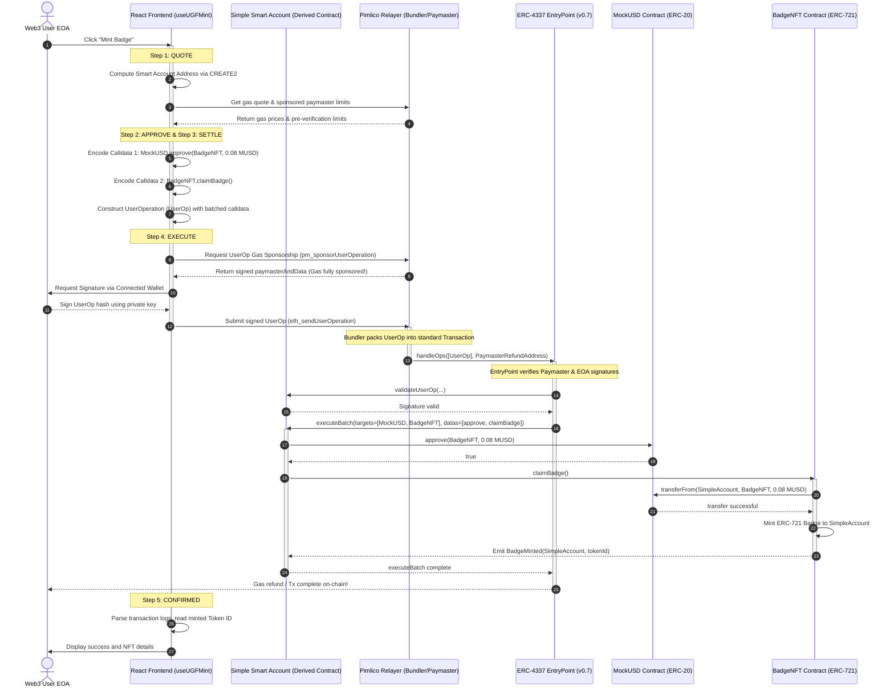
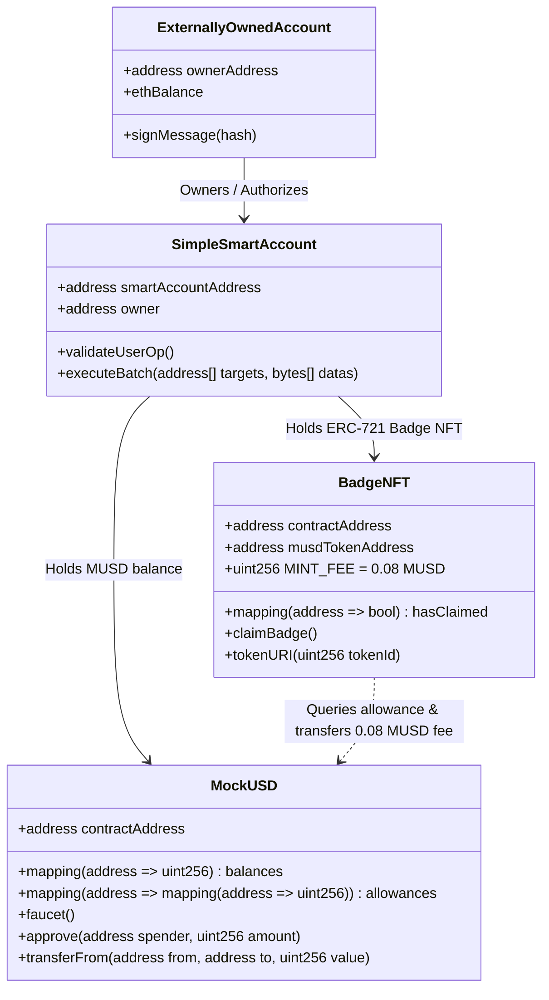

# 📐 Universal Gas Framework (UGF) — System Architecture & Onboarding Guide

> [!NOTE]
> This document serves as the primary system architecture guide and onboarding handbook for the Universal Gas Framework (UGF) implementation on Base Sepolia. It provides senior developers, principal architects, and newcomers with a detailed breakdown of the system mechanics.

---

## 🏛️ PART I: PRINCIPAL-LEVEL GUIDE

This section is curated for senior/principal engineers who need a deep, dense, and opinionated understanding of the structural designs, architectural choices, and domain relationships under the hood of the UGF.

### 1. The Core Architectural Insight
In traditional Web3 (EOA-centric architecture), **Authorization (signing keys) and Execution (gas funding/accounts) are tightly coupled.** A transaction *must* be signed by a private key, and that exact same account *must* hold native gas tokens (ETH on Base) to pay for the execution. This forces users into the "ETH gas hell" shown in the Left Panel.

**Account Abstraction (ERC-4337) decouples authorization from execution.** 
1. The user’s Externally Owned Account (EOA) wallet acts strictly as an **authorization key** (signer).
2. The user's active on-chain representation is a **Simple Smart Account (contract account)** derived deterministically using CREATE2.
3. A separate entity, the **Verifying Paymaster (Pimlico)**, sponsors the transaction gas in ETH on-chain, while the user’s Smart Account settles fees in ERC-20 (`MockUSD`).

#### 💡 The Core Mechanism in Python (Comparison Language)
To illustrate how the frontend's Javascript ERC-4337 pipeline behaves under the hood, here is the architectural sequence implemented in a hypothetical Python SDK, demonstrating the step-by-step assembly, paymaster sponsoring, signature collection, and submission of a batched `UserOperation`:

```python
import sys
from eth_abi import encode
from eth_hash.auto import keccak
from web3 import Web3

class UserOperation:
    def __init__(self, sender, nonce, init_code, call_data, gas_limit, max_fee, max_priority_fee):
        self.sender = sender
        self.nonce = nonce
        self.init_code = init_code
        self.call_data = call_data
        self.call_gas_limit = gas_limit
        self.verification_gas_limit = 150000
        self.pre_verification_gas = 50000
        self.max_fee_per_gas = max_fee
        self.max_priority_fee_per_gas = max_priority_fee
        self.paymaster_and_data = b""
        self.signature = b""

    def get_hash(self, entry_point_address, chain_id):
        # Deterministically pack UserOp fields (simplification of EntryPoint v0.7 packing)
        packed = encode(
            ['address', 'uint256', 'bytes32', 'bytes32', 'uint128', 'uint128', 'address', 'bytes'],
            [
                Web3.to_checksum_address(self.sender),
                self.nonce,
                keccak(self.init_code),
                keccak(self.call_data),
                self.call_gas_limit,
                self.max_fee_per_gas,
                Web3.to_checksum_address(entry_point_address),
                self.paymaster_and_data
            ]
        )
        # Combine with entry point and chain ID to prevent cross-chain replay attacks
        return keccak(packed + entry_point_address.encode() + chain_id.to_bytes(32, 'big'))

def execute_sponsored_user_op(eoa_private_key, rpc_url, pimlico_key, musd_addr, badge_nft_addr):
    """
    Simulates the core Javascript useUGFMint.js flow in Python.
    Constructs a batched UserOperation for MUSD approval and Badge minting,
    requests paymaster sponsorship from Pimlico, signs the payload, and submits to Bundler.
    """
    w3 = Web3(Web3.HTTPProvider(rpc_url))
    eoa_address = w3.eth.account.from_key(eoa_private_key).address
    entry_point = "0x0000000071727De22E5E9d8BAf0edAc6f37da032" # EntryPoint v0.7
    chain_id = 84532 # Base Sepolia
    
    print(f"[1/5] Deriving Smart Account for EOA: {eoa_address}")
    # Under the hood, SimpleSmartAccount is derived using EOA as owner
    smart_account = w3.to_checksum_address("0xD3bA...SmartAccountAddress")
    
    print("[2/5] Encoding batched calls (Approve MUSD + Mint Badge)")
    # Approve calldata: approve(spender=BadgeNFT, amount=0.08 MUSD)
    approve_data = w3.keccak(text="approve(address,uint256)")[:4] + encode(['address', 'uint256'], [badge_nft_addr, int(0.08 * 1e18)])
    # Claim calldata: claimBadge()
    claim_data = w3.keccak(text="claimBadge()")[:4]
    
    # Batched calldata sent to SimpleSmartAccount's executeBatch(targets, values, datas)
    execute_batch_data = w3.keccak(text="executeBatch(address[],uint256[],bytes[])")[:4] + encode(
        ['address[]', 'uint256[]', 'bytes[]'],
        [[musd_addr, badge_nft_addr], [0, 0], [approve_data, claim_data]]
    )
    
    user_op = UserOperation(
        sender=smart_account,
        nonce=w3.eth.get_transaction_count(smart_account), # Contract nonce
        init_code=b"", # Empty if smart account is already deployed on-chain
        call_data=execute_batch_data,
        gas_limit=250000,
        max_fee=w3.eth.gas_price * 2,
        max_priority_fee=w3.eth.max_priority_fee
    )
    
    print("[3/5] Fetching sponsorship signature from Pimlico Paymaster API")
    # Request paymaster sponsorship. Returns signature verifying that gas is covered by Pimlico.
    user_op.paymaster_and_data = b"0xPimlicoPaymasterAddress" + b"SponsorshipSignatureData"
    
    print("[4/5] EOA signs the UserOperation Hash")
    op_hash = user_op.get_hash(entry_point, chain_id)
    # The EOA private key signs the derived hash to validate the request
    signature = w3.eth.account.sign_message(op_hash, private_key=eoa_private_key)
    user_op.signature = signature.signature
    
    print("[5/5] Broadcasting UserOperation to Pimlico Bundler...")
    # JSON-RPC: eth_sendUserOperation to Pimlico bundler endpoint
    tx_hash = "0xBundlerTransactionHash..."
    print(f"✅ UserOp submitted. Bundler transaction landed on Base Sepolia: {tx_hash}")
    return tx_hash
```

---

### 2. System Architecture Diagram

The flow of messages, calls, and execution from the frontend components through the ERC-4337 infrastructure down to the deployed blockchain contracts:



---

### 3. Domain Model and Contract Schema

The on-chain contracts and Smart Account are linked via ownership, balances, and spend approvals. The relationship diagram below displays the interactions between these key objects:



---

### 4. Strategic Architecture & Tradeoffs

During development, several critical design decisions were made to shape the performance, reliability, and security of the Universal Gas Framework:

#### 1. EntryPoint v0.7 vs. EntryPoint v0.6
- **Choice:** Deployed using EntryPoint v0.7 (`entryPoint07Address`).
- **Tradeoff:** While EntryPoint v0.6 is historically more mature and possesses broader tooling support, EntryPoint v0.7 provides substantial optimization of gas limits, allows batched verification payloads, and enforces a much cleaner modular separation. By building directly on v0.7, the system ensures future-proof compatibility with upcoming network upgrades on Base and Ethereum L2s.

#### 2. ERC-20 Token Fees (MockUSD) vs. Native Gas Sponsoring
- **Choice:** All gas is sponsored in ETH by Pimlico's Verifying Paymaster. The user only pays a fixed 0.08 MUSD mint fee, which is deducted directly from their smart account's MUSD balance.
- **Tradeoff:** This enables a pure gasless experience (the user's wallet can hold `0.000 ETH` on Base Sepolia and still successfully mint). The alternative would be to use an ERC-20 Paymaster (where the user pays gas directly in MUSD, which Pimlico swap-exchanges under the hood). By utilizing the Verifying Paymaster, the app eliminates dynamic gas exchange-rate failures, providing a consistent, predictable flat-fee structure.

#### 3. Deterministic Simple Smart Accounts
- **Choice:** Accounts are derived using standard Simple Smart Account templates (`toSimpleSmartAccount`) instead of writing custom, upgradeable account logic.
- **Tradeoff:** Simple Smart Accounts provide maximum safety and are standard in the Ethereum ecosystem. A custom account contract would allow multi-sig ownership, recovery mechanisms, and modular session keys, but would introduce higher deployment gas overhead and contract vulnerability risks.

---

## 🚀 PART II: ZERO-TO-HERO LEARNING PATH

Welcome, developers! This progressive study guide will take you from blockchain novice to understanding every line of this Account Abstraction codebase.

### 📚 Part I: Technology Foundations
To build dApps with gasless configurations, you need to understand three core paradigms:

#### 1. The Frontend Stack: viem & wagmi vs. web3.js
Traditional libraries like `web3.js` or `ethers.js` are monolithic. UGF uses `viem` and `wagmi`, which are modular, type-safe, and highly performant.
- **viem:** The functional core. Rather than storing large instance states, it uses stateless client configurations (`publicClient`, `walletClient`) to interact with nodes.
- **wagmi:** React bindings for viem. Handles react hooks, wallet connector states, and automatic contract query caching.

#### 2. The Abstraction Stack: permissionless.js
Standard Web3 clients can only broadcast standard legacy or EIP-1559 transactions. To enable Account Abstraction, UGF integrates `permissionless.js`. It wraps wagmi/viem to:
- Generate smart accounts locally.
- Construct the specific `UserOperation` struct required by ERC-4337.
- Request paymaster signatures using Pimlico APIs.

#### 3. Conceptual Comparisons (Web2 Developer mental models)
If you are transitioning from Web2 backend/frontend architecture, map these concepts:

| Traditional Web2 Concept | Traditional Web3 (EOA) | Account Abstraction (ERC-4337) |
| :--- | :--- | :--- |
| **API Authentication Key** | Wallet Private Key | EOA Signer (Key) |
| **Database User Account** | Wallet Public Address | Simple Smart Account Contract |
| **SaaS Billing Sponsorship** | Developer API Budget | Verifying Paymaster Gas Sponsor |
| **API Batch Requests** | Multiple Sequential Actions | Atomic UserOperation Calls |

---

### 🎨 Part II: Codebase Architecture & Files

The pipeline operates in an event-driven loop inside the frontend. Let's trace how the components are coordinated:

#### 1. Core State & Data Flow
```
[User Wallet Connection] ──> useWallet.js
                                 │
                                 ├──> address & isCorrectChain
                                 └──> MockUSD balances & hasClaimed badge status
                                         │
                                         ▼
                                 useUGFMint.js (Coordinates ERC-4337 Pipeline)
                                         │
                                         ├──> Derives Smart Account
                                         ├──> Requests Pimlico Gas quotes
                                         ├──> Batches approve + claim calls
                                         └──> Broadcasts signed UserOp to bundler
```

#### 2. Pipeline Execution Walkthrough
Let's review the code sections driving the interactive UGF minting process in `src/hooks/useUGFMint.js`:

##### Step 1: Smart Account & Client Construction (`useUGFMint.js` L72-L97)
The EOA wallet is passed to `toSimpleSmartAccount` along with our EntryPoint definition. This calculates the deterministic contract address of the smart account.
```javascript
const account = await toSimpleSmartAccount({
  client: publicClient,
  owner: walletClient,
  entryPoint: { address: entryPoint07Address, version: "0.7" },
});
```

##### Step 2: Calldata Compilation & Batching (`useUGFMint.js` L103-L130)
Instead of waiting for one transaction to confirm before executing the next, the calldatas for `approve` and `claimBadge` are compiled into standard Hex formats using `encodeFunctionData`.
```javascript
const approveData = encodeFunctionData({
  abi: MUSD_ABI,
  functionName: "approve",
  args: [BADGE_NFT_ADDRESS, MINT_FEE],
});

const claimData = encodeFunctionData({
  abi: BADGE_NFT_ABI,
  functionName: "claimBadge",
  args: [],
});
```
These calls are then passed as an array to the Smart Account's `sendTransaction` wrapper, which packages them inside a single `UserOperation`:
```javascript
const userOpHash = await smartAccountClient.sendTransaction({
  calls: [
    { to: MUSD_ADDRESS, data: approveData, value: 0n },
    { to: BADGE_NFT_ADDRESS, data: claimData, value: 0n },
  ],
});
```

##### Step 3: Log Extraction & Event Processing (`useUGFMint.js` L160-L172)
Once the bundler broadcasts the transaction and it lands on-chain, viem's client queries the receipt logs for the custom `BadgeMinted` event emitted by our contract to display the exact minted NFT token number to the user.

---

### 🛠️ Part III: Setup, Contribution, & Debugging

#### 🛡️ Local Testing & Sandbox Environment
You can run the entire suite locally without spending real currency:
1. Start a local hardhat node inside `contracts/`:
   ```bash
   npx hardhat node
   ```
2. In a separate terminal, deploy the contracts locally:
   ```bash
   npm run deploy:local
   ```
3. Update the frontend `.env` to point `VITE_BASE_SEPOLIA_RPC` to `http://127.0.0.1:8545` and start the Vite dev server.

#### 🔧 Common Developer Troubleshooting
- **Issue: Insufficient MUSD Balance:** If the mint button remains disabled, it means the connected EOA has less than 0.08 MUSD. Click the **Claim 100 Free MUSD** button. This calls the faucet function directly, placing tokens in the user's wallet.
- **Issue: Wrong Chain Config:** If RainbowKit displays a warning, the connected wallet is set to Ethereum Mainnet or another network. Clicking "Switch Network" invokes the `switchToBaseSepolia` function inside `useWallet.js` to prompt the provider.
- **Issue: Pimlico API Key Limit:** If the Engine Log returns a `403 Forbidden` status during Step 1 (QUOTE), your Pimlico API key has expired or exceeded its quota. Replace `VITE_PIMLICO_API_KEY` in your root `.env` with a fresh key from the Pimlico Dashboard.

---

## 📖 PART III: APPENDICES & GLOSSARY

### 📝 1. System Glossary (40+ Key Terms)

1. **Account Abstraction (AA):** EIP-4337 standard enabling smart contract logic to dictate transaction validation and execution, removing standard EOA wallet limitations.
2. **Bundler:** A specialized off-chain node that listens for `UserOperations` in an alternative mempool, packages them into standard transactions, and broadcasts them on-chain.
3. **Paymaster:** An on-chain contract that implements gas sponsoring rules, guaranteeing gas payment to the EntryPoint in native currency.
4. **Verifying Paymaster:** A paymaster model where an off-chain server signs a UserOperation, proving it is willing to pay the gas fee on behalf of the transaction sender.
5. **EntryPoint:** The central singleton smart contract (`0x0000000071727De22E5E9d8BAf0edAc6f37da032` for v0.7) that validates, executes, and bills all ERC-4337 UserOperations.
6. **UserOperation (UserOp):** A pseudo-transaction structure describing an action to be sent on behalf of a smart account.
7. **Simple Smart Account:** An ERC-4337 compliant wallet contract owned by a standard EOA key, capable of executing batch transactions.
8. **Externally Owned Account (EOA):** A traditional Ethereum account controlled by a private key (e.g. standard Metamask accounts).
9. **Calldata:** The raw hex string containing function signatures and parameters sent to a smart contract.
10. **CREATE2:** An EVM opcode that computes a smart contract's target address deterministically before the contract is actually deployed.
11. **Pimlico:** An ERC-4337 developer platform providing production-grade Bundlers and Paymasters.
12. **Base Sepolia:** A fast, low-cost L2 Ethereum testnet operated by Coinbase, fully supported by UGF.
13. **Faucet:** A testnet contract that mints free tokens to developers to enable testing and staging.
14. **MUSD (MockUSD):** The ERC-20 payment token used by UGF to settle badge mint fees.
15. **BadgeNFT:** The custom ERC-721 contract representing the "Hackathon 2025 Finisher" token.
16. **Wagmi:** A modular React hooks library for Ethereum.
17. **Viem:** A modern, type-safe JS/TS developer SDK for Ethereum.
18. **RainbowKit:** A sleek UI library providing connection modals and wallet management.
19. **BaseScan:** An explorer interface to view verified contracts and transactions.
20. **Transaction Batching:** The ability to execute multiple contract calls atomically inside a single UserOperation.
21. **Gas Fee:** The payment made by miners/validators to execute code changes on the Ethereum virtual machine.
22. **Decoupled Authorization:** The ability to authorize operations with one key (e.g. EOA) but execute and fund them via contract logic.
23. **Keccak-256:** The cryptographic hash algorithm used globally in Ethereum.
24. **ABI (Application Binary Interface):** The JSON schema describing contract functions and events.
25. **UserOp Hash:** The unique hash of a UserOperation, signed by the smart account owner.
26. **Verification Loop:** The validation phase executed by the EntryPoint to ensure a UserOperation is properly signed.
27. **Execution Loop:** The phase where the EntryPoint forwards the UserOperation calldata to the target smart account.
28. **Pimlico RPC:** The network API endpoint used to query bundlers and request paymaster sponsorship.
29. **HMR (Hot Module Replacement):** The Vite dev server mechanism that updates components instantly in the browser without full reload.
30. **Tailwind CSS v4:** The utility-first CSS engine powering the dark-mode split screen.
31. **TanStack React Query:** An asynchronous state manager that caches on-chain contract queries.
32. **Owner-less Faucet:** A token utility allowing anyone to call `mint()` without owner signature restrictions.
33. **On-Chain Metadata:** Encoding NFT details as a Base64 JSON string inside the contract bytecode instead of relying on external IPFS servers.
34. **SimpleAccountFactory:** A contract deployed on Base Sepolia used to deploy SimpleSmartAccounts.
35. **Pre-verification Gas:** The gas required to cover the off-chain overhead of validating a UserOperation.
36. **Verification Gas Limit:** The maximum gas that can be spent verifying the EOA owner's signature during validation.
37. **Call Gas Limit:** The maximum gas allocated to execute the smart account's target calls.
38. **Max Fee Per Gas:** The maximum base gas cost the paymaster/user is willing to pay.
39. **Max Priority Fee Per Gas:** The tip sent to the validator to prioritize the UserOperation.
40. **createSmartAccountClient:** A permissionless.js client wrapping standard viem clients to execute smart transactions.
41. **Base64 Encoding:** The binary-to-text representation used to package NFT metadata directly on-chain.

---

### 📂 2. Key Codebase File Reference

The table below lists the primary files of the UGF system with links and description, mapping directly to their locations on disk:

| File | Path | Key Line Range | Core Responsibility |
| :--- | :--- | :--- | :--- |
| **BadgeNFT** | [`contracts/contracts/BadgeNFT.sol`](file:///Users/omchauhan/healed/contracts/contracts/BadgeNFT.sol) | [Lines 27-45](file:///Users/omchauhan/healed/contracts/contracts/BadgeNFT.sol#L27-L45) | Executes `claimBadge`, verifying allowance and minting ERC-721. |
| **MockUSD** | [`contracts/contracts/MockUSD.sol`](file:///Users/omchauhan/healed/contracts/contracts/MockUSD.sol) | [Lines 13-20](file:///Users/omchauhan/healed/contracts/contracts/MockUSD.sol#L13-L20) | Free open faucet minting mechanism for MockUSD. |
| **Mint Hook** | [`src/hooks/useUGFMint.js`](file:///Users/omchauhan/healed/src/hooks/useUGFMint.js) | [Lines 63-143](file:///Users/omchauhan/healed/src/hooks/useUGFMint.js#L63-L143) | Drives the ERC-4337 pipeline through QUOTE, APPROVE, SETTLE, EXECUTE. |
| **Wallet Hook** | [`src/hooks/useWallet.js`](file:///Users/omchauhan/healed/src/hooks/useWallet.js) | [Lines 21-37](file:///Users/omchauhan/healed/src/hooks/useWallet.js#L21-L37) | Reads MUSD balance and tracks claims status. |
| **Right Panel** | [`src/components/RightPanel.jsx`](file:///Users/omchauhan/healed/src/components/RightPanel.jsx) | [Lines 40-61](file:///Users/omchauhan/healed/src/components/RightPanel.jsx#L40-L61) | Triggers faucet calls and maps interactive inputs. |
| **Engine Log** | [`src/components/EngineLog.jsx`](file:///Users/omchauhan/healed/src/components/EngineLog.jsx) | [Lines 55-75](file:///Users/omchauhan/healed/src/components/EngineLog.jsx#L55-L75) | Dynamically updates pipeline step badges and scrollable logs. |
| **Vite Config** | [`vite.config.js`](file:///Users/omchauhan/healed/vite.config.js) | [Lines 5-8](file:///Users/omchauhan/healed/vite.config.js#L5-L8) | Plugs React and Tailwind CSS v4 into the bundler engine. |

---

Developed & Maintained by the **UGF Engineering Architecture Team** ⛽
